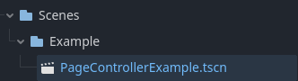
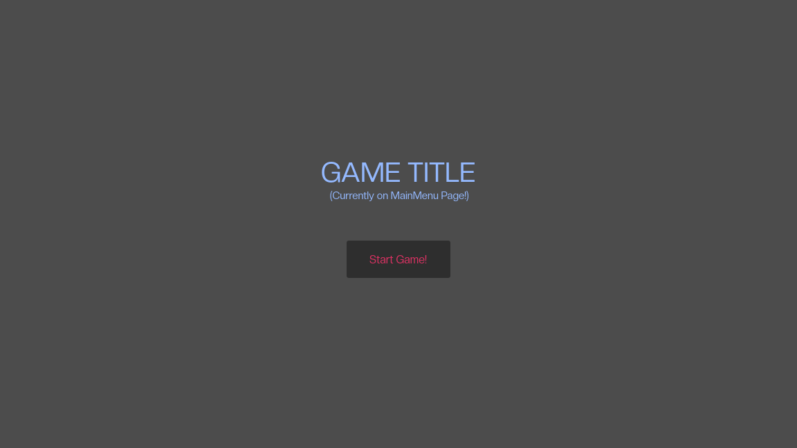

# NeonPageController

A **Godot Plugin** that **manages** **UI Pages** and makes **switching** between them **very easy and convenient**!

- [NeonPageController](#neonpagecontroller)
- [Overview](#overview)
  - [NeonSceneRunner Plugin](#neonscenerunner-plugin)
  - [What is a "Page"?](#what-is-a-page)
  - [How does it work?](#how-does-it-work)
- [Features](#features)
- [Installation](#installation)
- [Core Functionality](#core-functionality)
- [Setup](#setup)
- [Usage](#usage)
  - [Animating Pages](#animating-pages)
- [Example Usage](#example-usage)
    - [NeonPages-Example-PauseMenu.gd Script](#neonpages-example-pausemenugd-script)

# Overview

NeonPageController is a **Godot Plugin/Addon** that makes it boringly easy and straight-forward to **add, remove, manage and switch between UI "Pages"** in your Godot Projects!

## NeonSceneRunner Plugin
>[!NOTE]
In order to make **the most out of this Plugin** I reccomend checking out an **Addon** I made called [NeonSceneRunner](https://github.com/metapika/neon-scene-runner) that allows for **great Scene Management** and pairs well with this **UI Page** system! It is not needed, but very much reccomended!

## What is a "Page"?

Any **UI** that groups tightly related **UI Elements** and one that will most likely be shown by itself, for example: Menus such as **Main Menu or Settings**, **In-Game** HUD and Inventories/Chests, **Loading Screens, Dialogue Screens**, etc..)

Any game with **more complexity than Pong** will **really benefit** from this **Addon** as it is really versatile and makes it **really easy to manage ALL of your Game UIs**!

## How does it work?

Upon running a Scene that has a "**PageController**" Node in it, the **PageController** script enables the "**Start Page**" that's currently selected (by default it's the Main Menu). After that any script that has a reference to the **PageController Node** can use the functions: **\_turn_page_on** and **\_turn_page_off** in order to switch between **UI Pages**. The whole procedure of **enabling and disabling** pages is easy to grasp by anyone curious.

# Features

- Easily **access and reference** UI Pages by a user-defined **PageType enum**.
- Quickly **switch between** scene-dependant UIs.
- Easily add **transition animations** to Pages! 
- **Globally store** user interfaces to **never lose** **any** during scene changes!

# Installation

1.  In your Godot Project press the '**AssetLib**' button at the top:

1.  Search "**NeonPageController",** Download the **Plugin** and press 'Install'.
2.  Good job, you are ready to use **NeonPageController!**

# Core Functionality

Firstly, let's discuss the core aspects of the **Plugin.**

- ***PageType.gd*** - is a **class** that defines an **enum** of the same name. This is used in **all other scripts** to manage the **Pages.**
- ***Page*** - a custom **Node** that **groups** all elements belonging to a certain **Page Type** set by the user.
- ***PageController*** - a custom **Node** that's used to manage all Pages added to it's Page List.

# Setup

1.  Open the **PageType.gd** script located at "**res://addons/neon_page_controller/Scripts/Classes/PageType.gd".**
   
3.  Define any **PageTypes** for later use (The default types are: MainMenu, InGame, Paused and Loading, but feel free to remove them.)
       > [!CAUTION]
       >Leave the NONE PageType and make sure it's the first one defined as it's used in scripts everywhere and removing will cause many errors.
4. **With** [NeonSceneRunner](https://github.com/metapika/neon-scene-runner) Addon (**Reccomended**)
   - In the **Runner.tscn** Scene **add** the **PageController Node** by pressing **Ctrl+A** and searching for it. (It will now be available globally by any script by typing **App._page_controller**)
5. **Without** [NeonSceneRunner](https://github.com/metapika/neon-scene-runner) Addon:
   - In any scene (preferably a new one) **add** the **PageController Node** by pressing **Ctrl+A** and searching for it.
6.  In the **Inspector** you will see 3 values that you can edit:
    
    - **Start Page** - The default **Page** that will be set visible when starting the game;
    - **Pages** - An array that stores all references to **Page Nodes** in your **hierarchy**. Here you will **add ALL** of the **Pages** you want to turn on and off by the **PageController;**
    - **Debug Mode** - In order to easily Debug the inner workings of the Plugin I've added a **Debug Mode** that prints out messages to Godot's **Output Dock**. I've **enabled** it by default, but you can easily disable it by making the property **false;**
7.  After selecting the newly-created **PageController** press **Ctrl + A** again and add a **Page Node** to the Scene.
    
    - In the **Inspector** you will see 3 values that you can edit:
        - **PageType** - is the **type** the **Controller** will **identify** this **Page** with;
        - **Animate** - is a **bool** that tells the script whether it should **look** for an **AnimationPlayer** to **animate** the **closing and opening** of the **Page;**
        - **Open/Close Animation Name** - are both **animation names** the **Controller** will **try to trigger** when **animating** the **Page**;
    - **Change these values** accordingly to your needs for each **Page**.
8.  Do **Step 5** for **ALL** of the **PageTypes** that you want to make **Pages** for.
    
9.  After creating all of your **Pages**, add them to the **Pages** array on the **PageController.**
    
10. That's it, you are ready to use your **NeonPageController**!
    

# Usage

After making a reference to the PageController Node, in any of your scripts you can use the two following functions:

```c#
    _page_controller._turn_page_on(PT.PageType _page_on)
```
and 
```c#
    _page_controller._turn_page_off(PT.PageType _page_off)
```
> [!NOTE]
>If you are using the [NeonSceneRunner](https://github.com/metapika/neon-scene-runner) Addon you can automatically reference the _page_controller singleton by typing:
```c#
    App._page_controller.[FUNCTION]
```

\_turn_page_off function has a **second variation** that allows you to **switch** from **\_page_off** to a new **\_page_on**, instead of just turning off the **\_page_off** Page. You can call it like this:
```c#
    _page_controller._turn_page_off(PT.PageType _page_off, PT.PageType _page_on)
```

> [!CAUTION]
>Godot is not capable of making global enums, that's why if you want to use the PageType enum in your scripts you need to instantiate the class containing it like this:
>
```c#
## Loading in the script that contains the PageType Enum definition  
const PT = preload("res://addons/neon_page_controller/Scripts/Classes/PageType.gd")
```
And in order to use the enum you have to type it in like this:
```c#
var _example_page : PT.PageType
```
Alternatively, you can also **call all functions with ints** instead of the **PageType enum**, just remember to look up which types correspond to which index.

## Animating Pages

Here are the neccessary steps you need to take to Animate your Pages:

1.  **Open/Select** the **Page** you want to **animate** in the **Inspector**.
2.  Set the **Animate** bool on the **Node** to **True**.
3.  Add an **AnimationPlayer** as a child of the **Page**. You hierarchy should look like this:
    
4.  **Create/Add close and open** animations to the **AnimationPlayer** (**Make sure** both of them are **named just like** the **Open/Close Animation Name** variables on the **Page**)
5.  You're done! Now when the **Page** you **animated** is **enabled/disabled** it will **automatically** play the **two animations accordingly**!

# Example Usage

Upon importing the Plugin you will see new Folders show up in the root of your res:// directory:



In order to try out the **NeonPageController Addon** you can open the '**PageControllerExample.tscn**' Scene and **press** **F6** afterwards. You will be granted with an Example Title Screen for a game with a single '**Play Game!**' button:



You can play around with the **Example User Interfaces** by pressing the Play Game, Pause, Resume and Quit to Title Screen buttons, all **UIs** are color-coded to show that you are in fact **switching** between them.

### NeonPages-Example-PauseMenu.gd Script

This is the **Example Script** all the **Example UIs** use. You can preview the **example usage** of the **\_tun_page_on() and \_turn_page_off()** functions in this script. It **contains functions for the buttons** you can see on your screen and **shows many ways** you can use said functions.